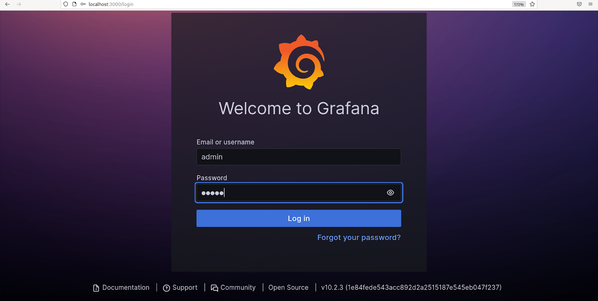

--- 
---

<h1 align="center"><b>Ansible playbook

--- 
---
 </u></b></h1>

<input value='Print' type='button' onclick='window.print()' />

## **Table of Contents** 

| S.No | Content                                                                                   |
|:----:|-------------------------------------------------------------------------------------------|
|  1   | [Create a tomcat container and deploy helloworld application](#Create-a-tomcat-container-and-deploy-helloworld-application) |
|  2   | [Check application deployed status](#Check-application-deployed-status)                     |
|  3   | [Create a prometheus and grafana container and configure the prometheus.yml file using playbook.](#Create-a-prometheus-and-grafana-container-and-configure-the-prometheus.yml-file-using-playbook.) |
|  4   | [Container Status](#Container-Status)                                                       |
|  5   | [Check Jmx metrics](#Check-Jmx-metrics)                                                     |
|  6   | [Open a Browser and check the targets](#Open-a-Browser-and-check-the-targets)               |
|  7   | [Now open a grafana and create a dashboard](#Now-open-a-grafana-and-create-a-dashboard)     |
|  8   | [Add a Data Source and Select Prometheus:](#Add-a-Data-Source-and-Select-Prometheus:)       |
|  9   | [Configure Prometheus Data Source](#Configure-Prometheus-Data-Source)                       |
| 10   | [Import a Dashboard](#Import-a-Dashboard)                                                  |
| 11   | [Copy Exported ID from Google and Paste ID and Complete Import](#Copy-Exported-ID-from-Google-and-Paste-ID-and-Complete-Import) |
| 12   | [Save the Imported Dashboard](#Save-the-Imported-Dashboard)                                 |
| 13   | [Grafana Dashboard](#Grafana-Dashboard)                                                     |


---

## Create a tomcat container and deploy helloworld application

```
 [root@node1 ansible]# cat tomcat2.yaml
```
```yaml
---
- name: Deploy Tomcat container and deploy WAR file using Podman
  hosts: localhost  

  tasks:
    - name: Install Podman Python bindings
      package:
        name: python3-podman
        state: present

    - name: Pull the Tomcat container image
      containers.podman.podman_image:
        name: docker.io/library/tomcat
        tag: latest

    - name: Create a directory for helloworld WAR file if not exists
      file:
        path: /tmp
        state: directory

    - name: Ensure helloworld.war file exists on the controller
      stat:
        path: /home/nidhi/shiksha/ansible/helloworld.war
      register: war_file

    - name: Fail if the helloworld.war file does not exist
      fail:
        msg: "The file /home/nidhi/shiksha/ansible/helloworld.war does not exist on the controller."
      when: not war_file.stat.exists

    - name: Copy helloworld.war to /tmp directory
      copy:
        src: /home/nidhi/shiksha/ansible/helloworld.war
        dest: /tmp/helloworld.war

    - name: Download JMX Prometheus Java agent JAR
      get_url:
        url: https://repo1.maven.org/maven2/io/prometheus/jmx/jmx_prometheus_javaagent/0.16.1/jmx_prometheus_javaagent-0.16.1.jar
        dest: /tmp/jmx_prometheus_javaagent-0.16.1.jar

    - name: Create setenv.sh for Tomcat
      copy:
        content: |
          JAVA_OPTS="$JAVA_OPTS -javaagent:/usr/local/tomcat/bin/jmx_prometheus_javaagent-0.16.1.jar=9999:/usr/local/tomcat/bin/tomcat.yml"
          export JAVA_OPTS
        dest: /tmp/setenv.sh
        mode: '0755'

    - name: Create tomcat.yml for JMX exporter
      copy:
        content: |
          lowercaseOutputLabelNames: true
          lowercaseOutputName: true
          rules:
          - pattern: 'Catalina<type=GlobalRequestProcessor, name="(\w+-\w+)-(\d+)"><>(\w+):'
            name: tomcat_$3_total
            labels:
              port: "$2"
              protocol: "$1"
            help: Tomcat global $3
            type: COUNTER
          - pattern: 'Catalina<j2eeType=Servlet, WebModule=//([-a-zA-Z0-9+&@#/%?=~_|!:.,;]*[-a-zA-Z0-9+&@#/%=~_|]), name=([-a-zA-Z0-9+/$%~_-|!.]*), J2EEApplication=none, J2EEServer=none><>(requestCount|maxTime|processingTime|errorCount):'
            name: tomcat_servlet_$3_total
            labels:
              module: "$1"
              servlet: "$2"
            help: Tomcat servlet $3 total
            type: COUNTER
          - pattern: 'Catalina<type=ThreadPool, name="(\w+-\w+)-(\d+)"><>(currentThreadCount|currentThreadsBusy|keepAliveCount|pollerThreadCount|connectionCount):'
            name: tomcat_threadpool_$3
            labels:
              port: "$2"
              protocol: "$1"
            help: Tomcat threadpool $3
            type: GAUGE
          - pattern: 'Catalina<type=Manager, host=([-a-zA-Z0-9+&@#/%?=~_|!:.,;]*[-a-zA-Z0-9+&@#/%=~_|]), context=([-a-zA-Z0-9+/$%~_-|!.]*)><>(processingTime|sessionCounter|rejectedSessions|expiredSessions):'
            name: tomcat_session_$3_total
            labels:
              context: "$2"
              host: "$1"
            help: Tomcat session $3 total
            type: COUNTER
        dest: /tmp/tomcat.yml

    - name: Run Tomcat container with JMX exporter
      containers.podman.podman_container:
        name: tomcat_container
        image: docker.io/library/tomcat:latest
        state: started
        ports:
          - "8080:8080"
          - "9999:9999"
        volumes:
          - /tmp/helloworld.war:/usr/local/tomcat/webapps/helloworld.war
          - /tmp/jmx_prometheus_javaagent-0.16.1.jar:/usr/local/tomcat/bin/jmx_prometheus_javaagent-0.16.1.jar
          - /tmp/setenv.sh:/usr/local/tomcat/bin/setenv.sh
          - /tmp/tomcat.yml:/usr/local/tomcat/bin/tomcat.yml

    - name: Wait for Tomcat to start
      wait_for:
        host: localhost
        port: 8080
        delay: 10
        timeout: 120

    - name: Verify Tomcat container is running
      command: podman ps --filter "name=tomcat_container" --format "{{.Status}}"
      register: container_status

    - name: Debug container status
      debug:
        var: container_status.stdout

    - name: Print Tomcat container logs for debugging
      command: podman logs tomcat_container
      register: tomcat_logs
      ignore_errors: yes

    - name: Debug Tomcat logs
      debug:
        var: tomcat_logs.stdout

    - name: Verify sample application is accessible
      uri:
        url: http://localhost:8080/helloworld/
        status_code: 200

```


## Check application deployed status
.png)


## Create a prometheus and grafana container  and configure the prometheus.yml file using playbook.

```
[root@node1 ansible]# cat prometheus.yml
```
``` yaml
---
- name: Monitor Tomcat application with Prometheus and Grafana
  hosts: localhost
  vars:
    prometheus_image: "prom/prometheus"
    prometheus_tag: "latest"
    grafana_image: "grafana/grafana"
    grafana_tag: "latest"
    prometheus_config_dir: "/tmp/prometheus"
    prometheus_config_file: "/tmp/prometheus/prometheus.yml"
    tomcat_target: "localhost:9999"

  tasks:
    - name: Install Podman Python bindings
      package:
        name: python3-podman
        state: present

    - name: Pull the Prometheus container image
      containers.podman.podman_image:
        name: "{{ prometheus_image }}"
        tag: "{{ prometheus_tag }}"

    - name: Pull the Grafana container image
      containers.podman.podman_image:
        name: "{{ grafana_image }}"
        tag: "{{ grafana_tag }}"

    - name: Create Prometheus configuration directory
      file:
        path: "{{ prometheus_config_dir }}"
        state: directory

    - name: Create Prometheus configuration file
      copy:
        content: |
          global:
            scrape_interval: 15s

          scrape_configs:
            - job_name: 'tomcat'
              static_configs:
                - targets: ['{{ tomcat_target }}']
        dest: "{{ prometheus_config_file }}"

    - name: Run Prometheus container
      containers.podman.podman_container:
        name: prometheus
        image: "{{ prometheus_image }}:{{ prometheus_tag }}"
        state: started
        ports:
          - "9090:9090"
        volumes:
          - "{{ prometheus_config_dir }}:/etc/prometheus"

    - name: Run Grafana container
      containers.podman.podman_container:
        name: grafana
        image: "{{ grafana_image }}:{{ grafana_tag }}"
        state: started
        ports:
          - "3000:3000"

    - name: Wait for Prometheus to start
      wait_for:
        host: localhost
        port: 9090
        delay: 10
        timeout: 120

    - name: Wait for Grafana to start
      wait_for:
        host: localhost
        port: 3000
        delay: 10
        timeout: 120

    - name: Print Prometheus container logs for debugging
      command: podman logs prometheus
      register: prometheus_logs
      ignore_errors: yes

    - name: Debug Prometheus logs
      debug:
        var: prometheus_logs.stdout

    - name: Print Grafana container logs for debugging
      command: podman logs grafana
      register: grafana_logs
      ignore_errors: yes

    - name: Debug Grafana logs
      debug:
        var: grafana_logs.stdout

    - name: Print instructions for accessing Grafana
      debug:
        msg: "Grafana is running at http://localhost:3000. Default username: admin, Default password: admin"

```

  

# Container Status 


**Check Jmx metrics** 
```
[root@node1 ansible]# curl localhost:9999/metrics
```

> \# HELP jvm_memory_objects_pending_finalization The number of objects waiting in the finalizer queue.
\# TYPE jvm_memory_objects_pending_finalization gauge
jvm_memory_objects_pending_finalization 0.0
\# HELP jvm_memory_bytes_used Used bytes of a given JVM memory area.
\# TYPE jvm_memory_bytes_used gauge
jvm_memory_bytes_used{area="heap",} 4.0465824E7
jvm_memory_bytes_used{area="nonheap",} 5.5425592E7
\# HELP jvm_memory_bytes_committed Committed (bytes) of a given JVM memory area.
\# TYPE jvm_memory_bytes_committed gauge
jvm_memory_bytes_committed{area="heap",} 7.86432E7
jvm_memory_bytes_committed{area="nonheap",} 5.767168E7
\# HELP jvm_memory_bytes_max Max (bytes) of a given JVM memory area.
\# TYPE jvm_memory_bytes_max gauge
jvm_memory_bytes_max{area="heap",} 1.979711488E9
jvm_memory_bytes_max{area="nonheap",} -1.0
\# HELP jvm_memory_bytes_init Initial bytes of a given JVM memory area.
\# TYPE jvm_memory_bytes_init gauge
jvm_memory_bytes_init{area="heap",} 1.23731968E8
jvm_memory_bytes_init{area="nonheap",} 7667712.0
\# HELP jvm_memory_pool_bytes_used Used bytes of a given JVM memory pool.
\# TYPE jvm_memory_pool_bytes_used gauge
jvm_memory_pool_bytes_used{pool="CodeHeap 'non-nmethods'",} 1558144.0
jvm_memory_pool_bytes_used{pool="Metaspace",} 3.1883592E7
jvm_memory_pool_bytes_used{pool="CodeHeap 'profiled nmethods'",} 1.2959744E7
jvm_memory_pool_bytes_used{pool="Compressed Class Space",} 2973296.0
jvm_memory_pool_bytes_used{pool="G1 Eden Space",} 1.6777216E7
jvm_memory_pool_bytes_used{pool="G1 Old Gen",} 2.356376E7
jvm_memory_pool_bytes_used{pool="G1 Survivor Space",} 124848.0
jvm_memory_pool_bytes_used{pool="CodeHeap 'non-profiled nmethods'",} 6050816.0
\# HELP jvm_memory_pool_bytes_committed Committed bytes of a given JVM memory pool.
\# TYPE jvm_memory_pool_bytes_committed gauge
jvm_memory_pool_bytes_committed{pool="CodeHeap 'non-nmethods'",} 2555904.0
jvm_memory_pool_bytes_committed{pool="Metaspace",} 3.2505856E7
jvm_memory_pool_bytes_committed{pool="CodeHeap 'profiled nmethods'",} 1.31072E7
jvm_memory_pool_bytes_committed{pool="Compressed Class Space",} 3407872.0
jvm_memory_pool_bytes_committed{pool="G1 Eden Space",} 4.9283072E7
jvm_memory_pool_bytes_committed{pool="G1 Old Gen",} 2.8311552E7
jvm_memory_pool_bytes_committed{pool="G1 Survivor Space",} 1048576.0
jvm_memory_pool_bytes_committed{pool="CodeHeap 'non-profiled nmethods'",} 6094848.0
\# HELP jvm_memory_pool_bytes_max Max bytes of a given JVM memory pool.
\# TYPE jvm_memory_pool_bytes_max gauge
jvm_memory_pool_bytes_max{pool="CodeHeap 'non-nmethods'",} 5836800.0
jvm_memory_pool_bytes_max{pool="Metaspace",} -1.0
jvm_memory_pool_bytes_max{pool="CodeHeap 'profiled nmethods'",} 1.22908672E8
jvm_memory_pool_bytes_max{pool="Compressed Class Space",} 1.073741824E9
jvm_memory_pool_bytes_max{pool="G1 Eden Space",} -1.0
jvm_memory_pool_bytes_max{pool="G1 Old Gen",} 1.979711488E9
jvm_memory_pool_bytes_max{pool="G1 Survivor Space",} -1.0
jvm_memory_pool_bytes_max{pool="CodeHeap 'non-profiled nmethods'",} 1.22912768E8
\# HELP jvm_memory_pool_bytes_init Initial bytes of a given JVM memory pool.
\# TYPE jvm_memory_pool_bytes_init gauge
jvm_memory_pool_bytes_init{pool="CodeHeap 'non-nmethods'",} 2555904.0
jvm_memory_pool_bytes_init{pool="Metaspace",} 0.0
jvm_memory_pool_bytes_init{pool="CodeHeap 'profiled nmethods'",} 2555904.0
jvm_memory_pool_bytes_init{pool="Compressed Class Space",} 0.0
jvm_memory_pool_bytes_init{pool="G1 Eden Space",} 1.3631488E7
jvm_memory_pool_bytes_init{pool="G1 Old Gen",} 1.1010048E8
jvm_memory_pool_bytes_init{pool="G1 Survivor Space",} 0.0
jvm_memory_pool_bytes_init{pool="CodeHeap 'non-profiled nmethods'",} 2555904.0
\# HELP jvm_memory_pool_collection_used_bytes Used bytes after last collection of a given JVM memory pool.
\# TYPE jvm_memory_pool_collection_used_bytes gauge
jvm_memory_pool_collection_used_bytes{pool="G1 Eden Space",} 0.0
jvm_memory_pool_collection_used_bytes{pool="G1 Old Gen",} 2.3557568E7
jvm_memory_pool_collection_used_bytes{pool="G1 Survivor Space",} 124848.0
\# HELP jvm_memory_pool_collection_committed_bytes Committed after last collection bytes of a given JVM memory pool.
\# TYPE jvm_memory_pool_collection_committed_bytes gauge
jvm_memory_pool_collection_committed_bytes{pool="G1 Eden Space",} 4.9283072E7
jvm_memory_pool_collection_committed_bytes{pool="G1 Old Gen",} 2.7262976E7
jvm_memory_pool_collection_committed_bytes{pool="G1 Survivor Space",} 1048576.0
\# HELP jvm_memory_pool_collection_max_bytes Max bytes after last collection of a given JVM memory pool.
\# TYPE jvm_memory_pool_collection_max_bytes gauge
jvm_memory_pool_collection_max_bytes{pool="G1 Eden Space",} -1.0
jvm_memory_pool_collection_max_bytes{pool="G1 Old Gen",} 1.979711488E9
jvm_memory_pool_collection_max_bytes{pool="G1 Survivor Space",} -1.0
\# HELP jvm_memory_pool_collection_init_bytes Initial after last collection bytes of a given JVM memory pool.
\# TYPE jvm_memory_pool_collection_init_bytes gauge
jvm_memory_pool_collection_init_bytes{pool="G1 Eden Space",} 1.3631488E7
jvm_memory_pool_collection_init_bytes{pool="G1 Old Gen",} 1.1010048E8
jvm_memory_pool_collection_init_bytes{pool="G1 Survivor Space",} 0.0
\# HELP tomcat_bytesreceived_total Tomcat global bytesReceived


## Open a Browser and check the targets
```
http://localhost:9090/targets?search=
```

.png)


## Now open a grafana and create a dashboard
```
http://localhost:3000/
```

 > By Default password :- admin 
User :- admin




## Add a Data Source and Select Prometheus:

> - In the Grafana dashboard, navigate to the "Settings" menu (gear icon on the left sidebar).
>  - Click on "Data Sources" and then click on "Add your first data source."
>  - Choose Prometheus from the list of available data sources.

.png)


## Configure Prometheus Data Source
> In the settings for Prometheus, set the HTTP URL to: http://localhost:9090

.png)


## Import a Dashboard
> - Return to the Grafana dashboard and click on the "+" icon on the left sidebar.
>  - Select "Import" to import a new dashboard.

.png)


## Copy Exported ID from Google and Paste ID and Complete Import
> - Paste the exported ID in the designated field in the Grafana import dialog.
> - Follow the import process, confirming settings and making adjustments if needed.


.png)


## Save the Imported Dashboard
> Once the import is complete, save the dashboard. You can do this by clicking the "Save" icon and providing a name for your dashboard.

## Grafana Dashboard
.png)

<h1 align="center"><b>*****</u></b></h1>
